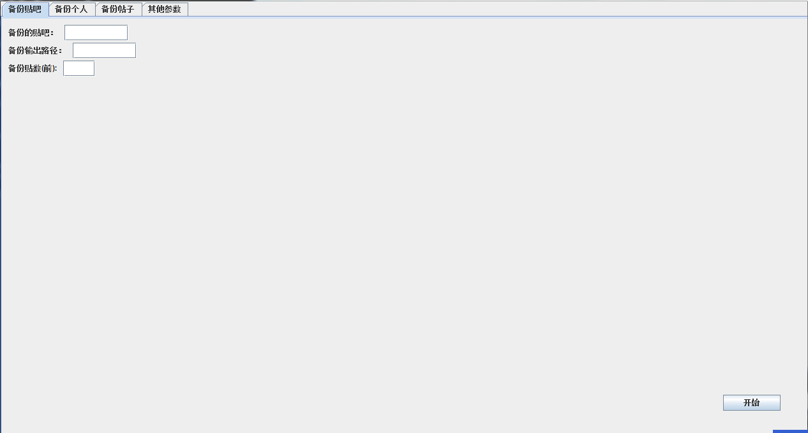
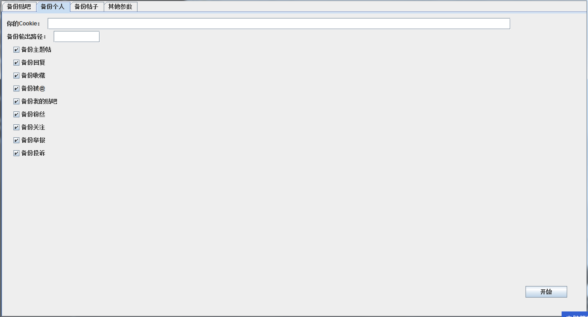
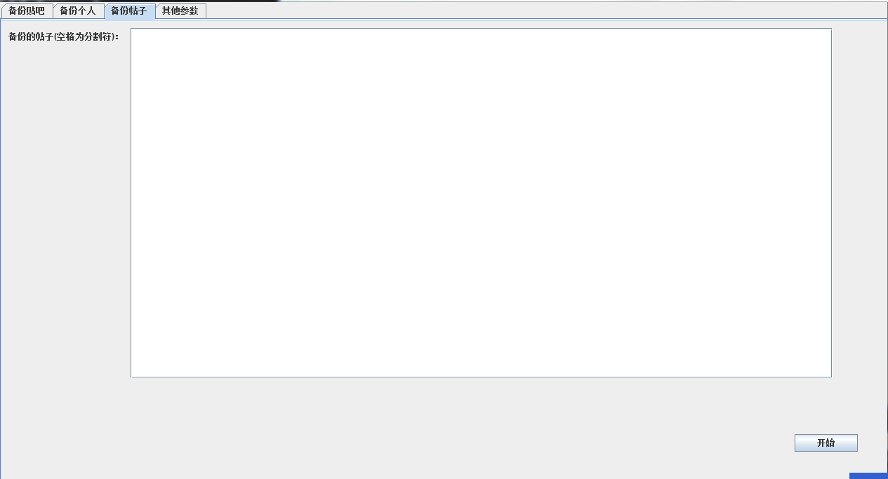
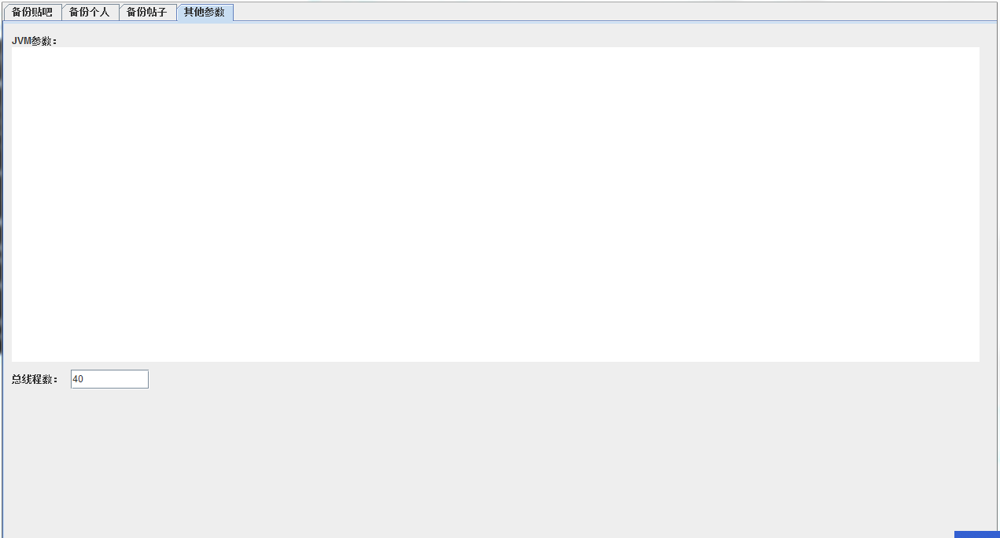

# E龙贴吧备份

**V0.8.5版本，应该没有问题**<br>
贴吧备份工具，可以备份你的贴吧<br>
<br>
**下载地址：**[E龙贴吧备份V0.8.5.zip](https://github.com/EnDragon/EDragon_TiebaBackup/files/4941772/E.V0.8.5.zip)
<br><br>
EDragonTiebaBackup<br>
E龙贴吧备份器<br>
大家可以使用<br>
<br>
这是一个贴吧备份软件，可以备份一整个吧的帖子，可以备份你自己的主题帖，回复，收藏，<br>
@，你的贴吧，你的粉丝，你的关注，你的举报等等<br>
<br>
V0.8 版本，加入 GUI 界面，可以不用去敲命令行了，放低了门槛，全程傻瓜化操作，<br>
修复了些 bug<br>
V0.8.2 重写了架构<br>
<br>
## 使用教程：
首先下载这个软件，如目录所示，尽量选高版本<br>
这个软件需要安装环境为java，可以去：https://www.java.com<br>
下载完成后<br>
可以参照"说明.pdf"打开看怎么操作<br>
<br>
### 用户界面操作：
首先打开"运行我打开GUI.bat"<br>
可以看到打开了一个GUI<br>
不解释，都能看懂<br>
<br>
然后点开始就行了<br>
<br>
备份个人时Cookie只需要输入BDUSS=……..和STOKEN=……..，分号别丢<br>
<br>
<br>
备份散开的帖子每个贴号之间用空格隔开<br>
<br>
其他参数里JVM参数可以上网上查，为防止你被听的云里雾里，这里只说两个简单的参数：<br>
		`-Xmx<内存大小>表示最大内存大小<br>`<br>
		`-Xms<内存大小>表示初始内存大小<br>`<br>
		`例如：-Xmx2048m表示最大运行内存为2048mb`<br>
		` 如果你要备份很多的贴，特长的贴等等，请将最大内存调大点，不然会超出内存，导致失败`<br>
<br>
最后点开始就行了<br>
<br>
### 命令行使用方法：
在这里调出命令窗口<br>
在运行之前请先输入chcp 936调整编码，不然输出到CMD上的都是乱码<br>
输入java -Dfile.encoding=utf-8 -jar BackUp.jar<br>
后面是参数
```
bakBar是备份贴吧
后面的参数是：
	[贴吧网址] [备份到本地的路径] [要备份的贴数（主题帖数量）]
		[贴吧网址]就是贴吧的网址，比如：https://tieba.baidu.com/f?kw=ndragon&ie=utf-8
			后面不要加上&pn=，它会自己加上
		[备份到本地的路径]是备份到本地的路径，比如：F:\TIEBA_BAK
			后面不要加上\，这个加不加会不会产生影响没测试过


bakPerssion是备份个人
后面参数是：
	[你的个人Cookie(我不会代码登陆贴吧(T_T)，只能用这样)][备份到本地的路径]
		[你的个人Cookie]可以调出检查点击头像找（我是网络编程小白(T_T)）


bak
	[贴号] [备份到本地的路径]
		[贴号]可以有多个用空格隔开


后面还有一个补充参数：
		-totelThreadNum 后面加数字，表示在读取网页时的多线程数量，默认是40
		-noThread 表示不备份主题帖，后面不用加参数
		-noReply 表示不备份回复，后面不用加参数
		-noLike 表示不备份收藏
		-noAt 表示不备份我被@到的
		-noBars 表示不备份我的贴吧
		-noFans 表示不备份我的粉丝
		-noConcerns 表示不备份我的关注
		-noReport 表示不备份我的举报
		-noCompain 表示不备份我的投诉
		-hasFansTies 表示备份粉丝的主页
		-noCheck表示不对文件进行检查，因为本软件获取验证的网址github很不稳定，所以有可能导致获取了N次也没有获取到，导致检查不了，如果一直获取不到请加上-noCheck
```

#### 例子：
```
   备份我个人的贴：
       java -Dfile.encoding=utf-8 -jar BackUp.jar bakPerssion "[我的Cookie]" "F:\I"
   备份ndragon吧前100贴：
       java -Dfile.encoding=utf-8 -jar BackUp.jar bakBar "https://tieba.baidu.com/f?kw=ndragon&ie=utf-8" "F:\backup" 100
   备份我个人的除了主题帖，回复外的内容：
       java -Dfile.encoding=utf-8 -jar BackUp.jar bakPerssion "[我的Cookie]" "F:\I" –noThread -noReply
```

**一般情况下直接用GUI就行了，命令提示符不用在意**<br><br>
**这个软件运行起来是耗流量的，因为他本身就是爬取网上的帖子**<br>
**这是基本操作信息，更多信息请至"说明.pdf"**

